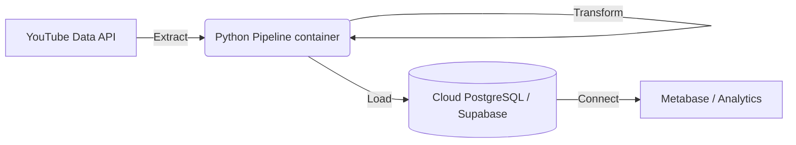

# YouTube Analytics Pipeline

A robust, modular, and containerized data pipeline that extracts YouTube channel and video data, transforms it for analytical readiness, and loads it into a Cloud PostgreSQL database (Supabase).

## 🏗 Architecture



### Tech Stack
- **Language**: Python 3.11
- **Dependency Manager**: `uv`
- **Containerization**: Docker & Docker Compose
- **Database**: PostgreSQL (Supabase)
- **Orchestration**: Custom Python Controller (`src/main.py`)
- **Version Control**: Git

## 🚀 Setup & Installation

### Prerequisites
- Docker Desktop installed and running.
- A YouTube Data API Key (from Google Cloud Console).
- A Cloud PostgreSQL Database (e.g., Supabase, Neon).
- `git`

### 1. Clone the Repository
```bash
git clone <repository_url>
cd youtube-analytics-pipeline
```

### 2. Configure Environment
Create a `.env` file in the root directory based on `.env.example`:
```bash
cp .env.example .env
```
Fill in your credentials:
```env
YOUTUBE_API_KEY=your_api_key
YOUTUBE_CHANNEL_IDS=channel_id_1,channel_id_2
DB_HOST=your.supabase.db.url
DB_PORT=5432
DB_NAME=postgres
DB_USER=postgres
DB_PASSWORD=your_password
```

### 3. Initialize Database
The pipeline requires specific tables (`channels`, `videos`, `daily_metrics`). Warning: This script drops existing tables.
```bash
# You can run this locally if you have uv installed, or via docker (custom command required)
uv run python scripts/init_db.py
```
*Alternatively, you can manually execute `sql/schema.sql` in your database's SQL editor.*

## 🏃 Usage

### Run the Pipeline
The entire pipeline (Extract -> Transform -> Load) runs inside a Docker container.

```bash
chmod +x scripts/run_pipeline.sh
./scripts/run_pipeline.sh
```

**What happens?**
1. Docker container builds/starts.
2. Pipeline reads channel IDs from `.env`.
3. Fetches latest data from YouTube API.
4. Updates channel and video metadata in `channels` and `videos` tables.
5. Appends new daily snapshots to `channel_daily_metrics` and `video_daily_metrics`.

## 📁 Project Structure

```
youtube-analytics-pipeline/
├── docker/                 # Docker configuration
│   └── Dockerfile          # Python environment definition
├── scripts/                # Utility scripts
│   ├── run_pipeline.sh     # Main execution script
│   ├── init_db.py          # Database reset/init script
│   └── test_connection.py  # (Removed) Connection tester
├── sql/                    # SQL artifacts
│   └── schema.sql          # Database schema definition
├── src/                    # Source code
│   ├── extract/            # YouTube API logic
│   ├── transform/          # Data cleaning & dataframe creation
│   ├── load/               # Database loading (SQLAlchemy)
│   └── main.py             # Pipeline entry point
├── .env.example            # Environment template
├── docker-compose.yml      # Service definition
├── pyproject.toml          # Python dependencies (uv)
└── max_run_log.txt         # Execution logs (if saved)
```
