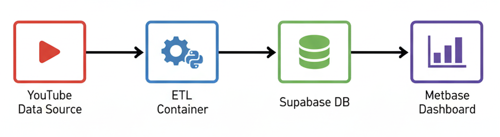

# YouTube Analytics Pipeline (Star Schema)

A production-grade, containerized data pipeline that extracts YouTube channel, video, and comment data, transforms it into a **Star Schema**, and populates a Supabase PostgreSQL database for Metabase visualizations.

Optimized for **macOS Apple Silicon (M1/M2/M3)**.

---

## 📖 General Overview
*For viewers getting started with the project.*

### Project Goal
To build a robust, self-hosted analytics solution that allows creators to track their YouTube performance without relying solely on YouTube Studio. This project owns the data, allowing for custom historical analysis and cross-channel comparisons.

### Key Features
*   **Automated Data Extraction**: Python scripts run daily to fetch the latest video stats and comments.
*   **Star Schema Databases**: Optimized data structure (`facts` and `dimensions`) for fast querying.
*   **Interactive Dashboards**: Built on Metabase, allowing for deep dives into subscriber growth, engagement rates, and viral video detection.
*   **Containerized**: Fully Dockerized for easy deployment and replication.

### Architecture Block Diagram


**Data Flow Explanation:**
1.  **Extract**: The ETL container fetches raw data (stats, comments) from the **YouTube Data API**.
2.  **Transform**: Data is cleaned and structured into a **Star Schema** (Dimensions & Facts).
3.  **Load**: Processed data is upserted into **Supabase PostgreSQL** to ensure history is preserved.
4.  **Visualize**: **Metabase** connects to the database to power the analytics dashboards.

---

## 📊 Dashboard & Creation Process
*How I built the analytics dashboard and the technical decisions behind it.*

### 1. Data Modeling (Star Schema)
I moved away from flat tables to a **Star Schema** to make the analytics more scalable and easier to query in Metabase.
*   **Fact Tables** (`fact_channel_daily`, `fact_video_daily`): Store key metrics like views, likes, and comments for every single day.
*   **Dimension Tables** (`dim_channel`, `dim_video`, `dim_date`): Store descriptive attributes like video titles, publish dates, and categories.

### 2. Dashboard Design (Metabase)
I connected Metabase directly to the Supabase PostgreSQL database. The dashboard is designed to answer specific questions:
*   **"How is my channel growing?"** -> *Subscriber Growth Trend* (Line Chart using `analytics.channel_growth`).
*   **"Which videos are performing best?"** -> *Top Videos Table* (Sorted by `total_views` from `analytics.video_performance`).
*   **"When should I upload?"** -> *Best Upload Day* (Bar chart grouping average views by `day_of_week`).

### 3. Key SQL Queries
Instead of relying only on Metabase's GUI, I wrote optimized SQL queries (available in `metabase/dashboard_queries.sql`) to handle complex logic:
*   **Viral Video Detection**: Identifies videos with >3x the average channel views.
*   **Engagement Rate**: Calculates `(Likes + Comments) / Views` percentage dynamically.

### 4. Running the Dashboard
1.  **Start Services**: `docker-compose up -d` starts the Metabase container.
2.  **Access UI**: Open `http://localhost:3000`.
3.  **Connect Data**: Point Metabase to the Supabase host defined in `.env`.
4.  **Visualize**: Use the pre-built views in the `analytics` schema to drag-and-drop charts.

---

## 🚀 Setup & Installation

### Prerequisites
-   Docker Desktop.
-   Supabase Project (Connection string).
-   YouTube Data API Key.

### Quick Start
1.  **Clone & Config**:
    ```bash
    git clone <repo_url>
    cp .env.example .env
    # Edit .env with your credentials
    ```
2.  **Initialize Schema**:
    ```bash
    docker-compose run --rm etl uv run python etl/scripts/init_db.py
    ```
3.  **Run Pipeline**:
    ```bash
    docker-compose run --rm etl
    ```
4.  **View Dashboard**: Go to http://localhost:3000.

**Folder Structure**:
```
project-root/
├── etl/                # Python ETL Application
│   ├── src/            # Source code (extract, transform, load)
│   ├── sql/            # Star Schema and Views
│   ├── scripts/        # Init DB and utility scripts
│   └── Dockerfile      # Container definition
├── metabase/           # Metabase configuration & queries
├── docker-compose.yml  # Root orchestration
└── .env.example        # Config template
```
